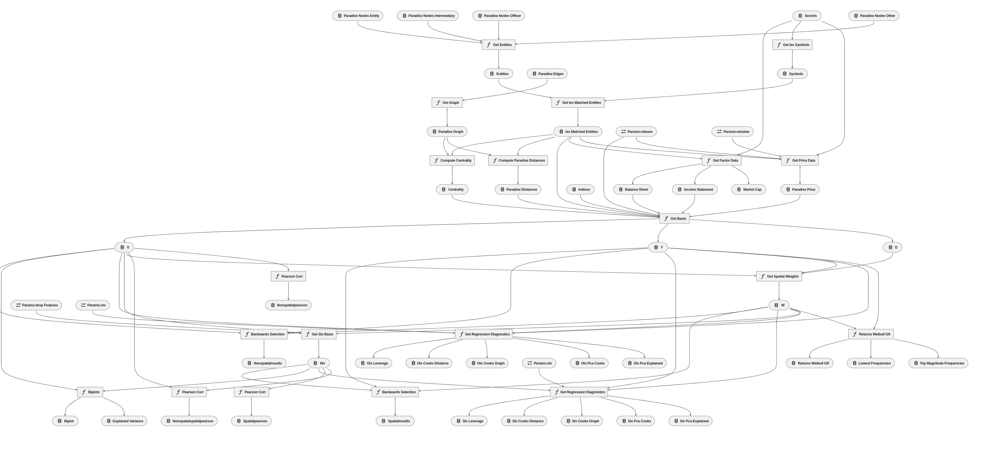

# precarious-papers
The Paradise Papers represent one of the largest public data leaks comprising 13.4 million confidential electronic documents.  A dominant theory presented by Neal (2014) and Griffith et al.(2014) concerns the use of these offshore services in the relocation of intellectual property for the purposes of compliance, privacy and tax avoidance.  Building on the work of Fernandez (2011), Billio et al.(2016) and Kou et al.(2018) in Spatial Arbitrage Pricing Theory (s-APT) and work by Kelly et al.(2013), Ahern (2013), Herskovic (2018) and Proch ́azkov ́a (2020) on the impacts of network centrality on firm pricing, we use the market response, discussed in O’Donovan et al.(2019), to characterise the role of offshore services in securities pricing and the transmission of price risk.


## Overview

This is your new Kedro project, which was generated using `Kedro 0.15.6` by running:

```
kedro new
```

Take a look at the [documentation](https://kedro.readthedocs.io) to get started.


## Installing dependencies

Dependencies should be declared in `src/requirements.txt` for pip installation and `src/environment.yml` for conda installation.

To install them, run:

```
kedro install
```
and either:
```
conda install --file src/conda.yml
```
or:
```
mamba install --file src/conda.yml
```
For those using [mamba](https://github.com/mamba-org/mamba) alongside the [Anaconda package manager](https://docs.anaconda.com/)

For those looking to run the pipeline, a docker container as been provided for use in reproducing our analysis. This can be run to recreate our environment using:
```
docker-compose run python
```
This will assume all raw data sources have been downloaded

## Running Kedro

You can run your Kedro project with:

```
kedro run
```
This will assume a IEXCloud api key is provided in `config/local/secrets.yml` as:
```
iex: YOUR_KEY
```
For researchers using our downloaded data, they may use:
```
kedro run --tag=local --parallel
```
This will assume all data is already available in the data directory.

The pipeline currently follows the current `io` topology:



### Working with Kedro from notebooks
Our analysis does provide `py:percent` format notebooks which provides discussion over our exploratory work. This can be run either directly in a notebook environment that support `py:percent`, like VSCode, or may be converted to `ipynb` files using:
```
jupytext --to ipynb *.py
```

In order to use notebooks in your Kedro project, you need to install Jupyter, this has already been included in our conda environment but is an important flag for those running our exploratory analysis:

```
pip install jupyter
```

For using Jupyter Lab, you need to install it:

```
pip install jupyterlab
```

After installing Jupyter, you can start a local notebook server:

```
kedro jupyter notebook
```

You can also start Jupyter Lab:

```
kedro jupyter lab
```

And if you want to run an IPython session:

```
kedro ipython
```

Running Jupyter or IPython this way provides the following variables in
scope: `proj_dir`, `proj_name`, `conf`, `io`, `parameters` and `startup_error`. This abstracts and simplies interaction with our versioned datasets or API endpoints and ensure data is being loaded and serialized in a consistent manner. 


## API documentation
Project documentation has been provided to guide users through our code. This can be found at the `docs/index.html`.

To build API docs for your code using Sphinx, run:

```
kedro build-docs
```

See your documentation by opening `docs/build/html/index.html`.

A precommit hook has been added to this project to automatically build this documentation to be served on [Github Pages](https://pages.github.com/). This should allow users a familiar interface for navigating the documentation accoumpanying our code. 
